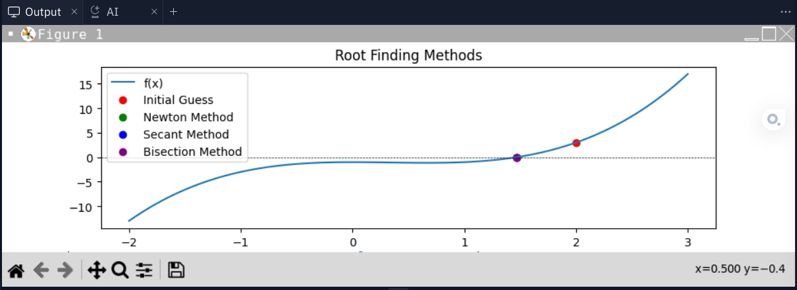

# 수학 근 구하기 그래프

```python
import numpy as np
import matplotlib.pyplot as plt


def f(x):
  return x**3 - x**2 - 1 # f(x) 식


def df(x):
  return 3 * x**2 - 2 * x  f(x) 미분 식


def newton_method(initial_guess, epsilon=1e-6, max_iterations=100): # 뉴턴 방법 함수
  x = initial_guess
  for i in range(max_iterations):
    x = x - f(x) / df(x)
    if abs(f(x)) < epsilon:
      return x, i, abs(f(x))
  return None, max_iterations, None


#1e-6 = 0.000001
def secant_method(initial_guess1,
                  initial_guess2,
                  epsilon=1e-6,
                  max_iterations=100): # 할선법 함수
  x_n_minus_1 = initial_guess1
  x_n = initial_guess2

  for i in range(max_iterations):
    f_x_n_minus_1 = f(x_n_minus_1)
    f_x_n = f(x_n)

    x_n1 = x_n - (f_x_n * (x_n - x_n_minus_1)) / (f_x_n - f_x_n_minus_1)

    if abs(f(x_n1)) < epsilon:
      return x_n1, i, abs(f(x_n1))

    x_n_minus_1 = x_n
    x_n = x_n1

  return None, max_iterations, None


def bisection_method(a, b, epsilon=1e-6, max_iterations=100): # 이분법 함수
  for i in range(max_iterations):
    c = (a + b) / 2
    if abs(f(c)) < epsilon:
      return c, i, abs(f(c))
    if f(a) * f(c) < 0:
      b = c
    else:
      a = c
  return None, max_iterations, None


x_vals = np.linspace(-2, 3, 100)
y_vals = f(x_vals)

# 그래프 값 출력에 나타내기
plt.plot(x_vals, y_vals, label='f(x)')
plt.axhline(0, color='black', linewidth=0.5, linestyle='--')
initial_guess = 2.0
plt.scatter(initial_guess,
            f(initial_guess),
            color='red',
            label='Initial Guess')

root_newton, iterations_newton, accuracy_newton = newton_method(initial_guess)
plt.scatter(root_newton, f(root_newton), color='green', label='Newton Method')

# 초기값 (할선법은 두 초기치)
initial_guess1 = 1.0
initial_guess2 = 2.5
root_secant, iterations_secant, accuracy_secant = secant_method(
    initial_guess1, initial_guess2)
plt.scatter(root_secant, f(root_secant), color='blue', label='Secant Method')

root_bisection, iterations_bisection, accuracy_bisection = bisection_method(
    1.0, 3.0)
plt.scatter(root_bisection,
            f(root_bisection),
            color='purple',
            label='Bisection Method')

# 결과출력
print(
    f'Newton Method: Root={root_newton}, Iterations={iterations_newton}, Accuracy={accuracy_newton*100000000}'
)
print(
    f'Secant Method: Root={root_secant}, Iterations={iterations_secant}, Accuracy={accuracy_secant*100000000}'
)
print(
    f'Bisection Method: Root={root_bisection}, Iterations={iterations_bisection}, Accuracy={accuracy_bisection*100000000}'
)

plt.title('Root Finding Methods')
plt.legend()
plt.show()
```

result
------

```
Newton Method: Root=1.4655713749070918, Iterations=3, Accuracy=50.240189741757035
Secant Method: Root=1.465571205895194, Iterations=6, Accuracy=9.126169642215132
Bisection Method: Root=1.465571403503418, Iterations=20, Accuracy=60.28480861175467
```